# Pertemuan 7 REST API Development

### Latihan 3-4 

#### GET All Books:

#### GET Book ID = 4
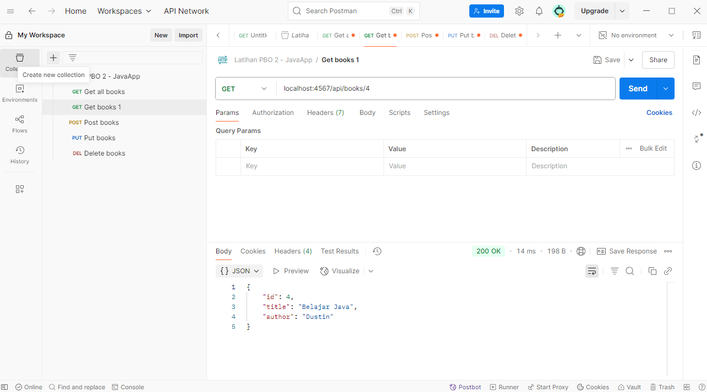

#### POST Book
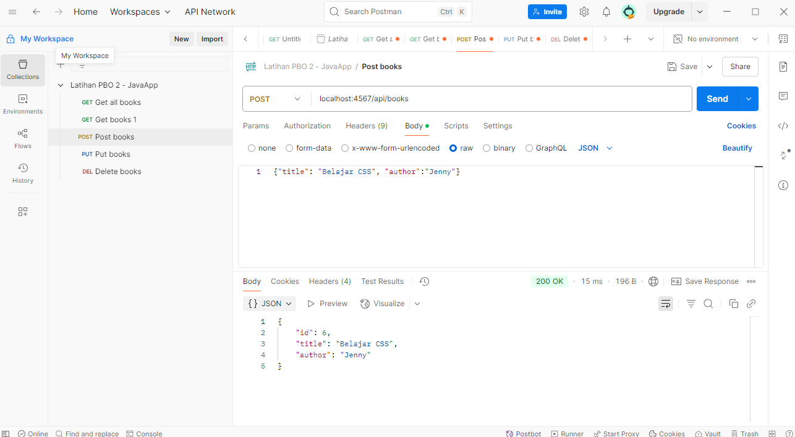

#### PUT Book ID = 3
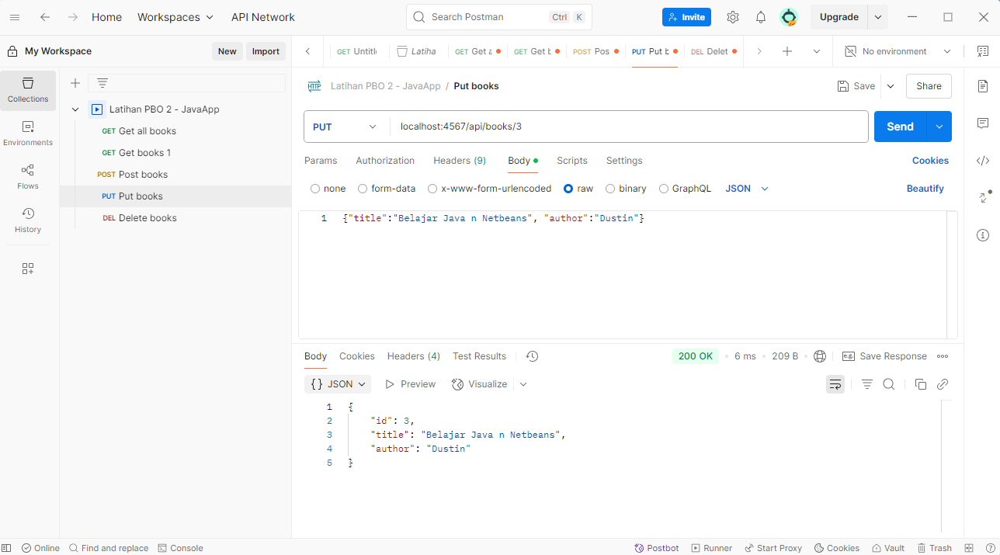

#### DELETE Book ID = 3
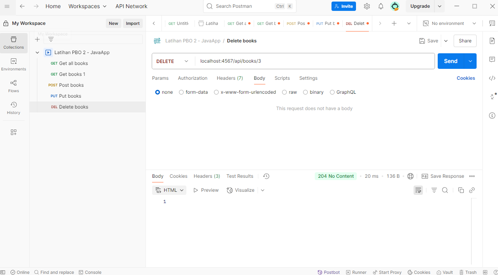

### Latihan 5 

#### Tampilan tanpa data
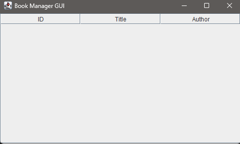

#### Tampilan setelah menambahkan data dengan Postman
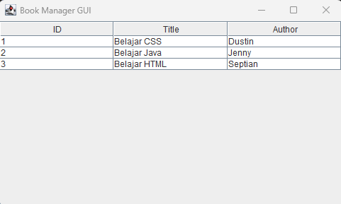

### Latihan 6 

#### Tampilan sebelum di refresh
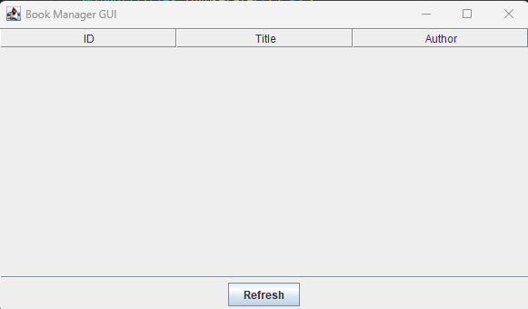

#### Tampilan setelah di refresh
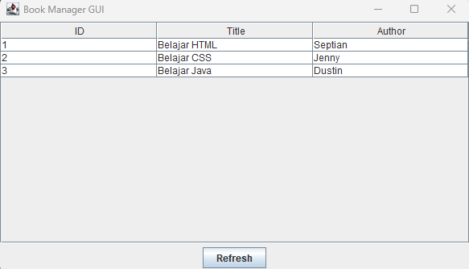

  
### Latihan 7 

#### Sebelum Menambah Data
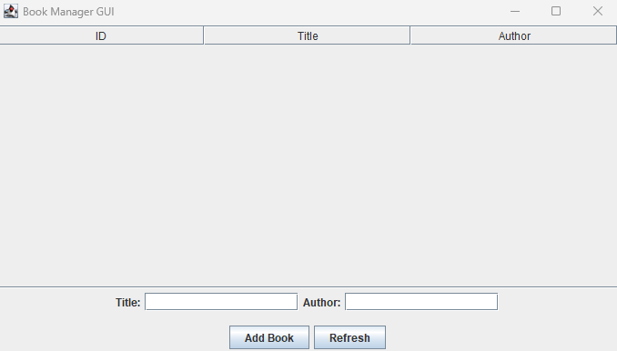

#### Proses Penambahan Data
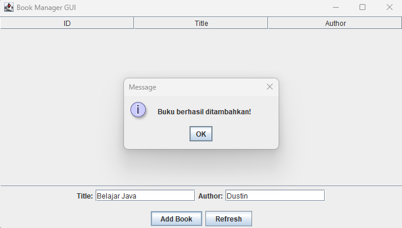

#### Hasil Penambahan
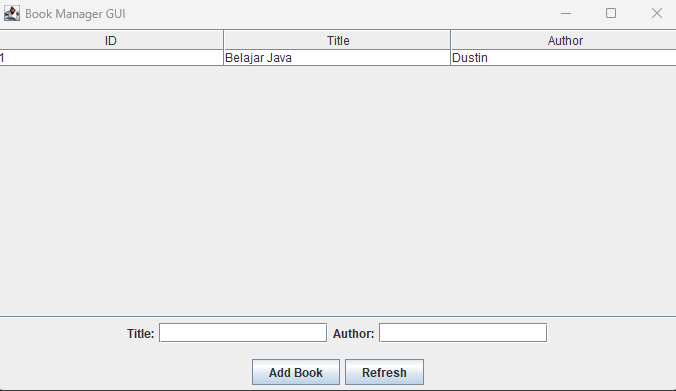

### Tugas 

#### Menambahkan Data
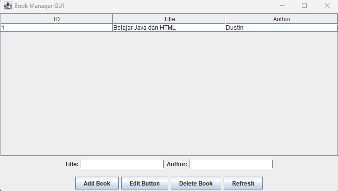

#### Mengedit Data
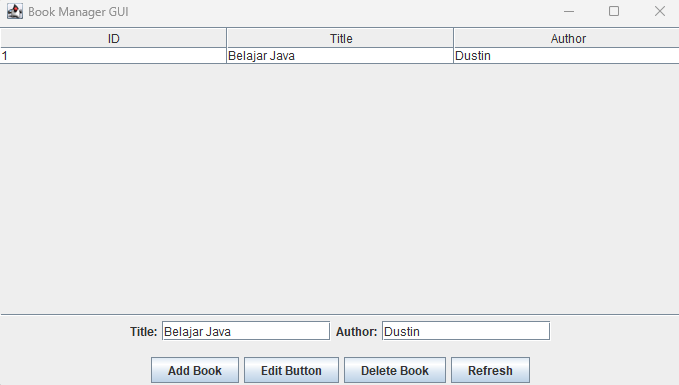

#### Menghapus Data
##### Konfirmasi Penghapusan
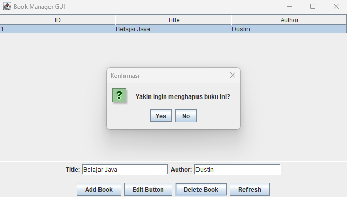

##### Notifikasi Berhasil Dihapus
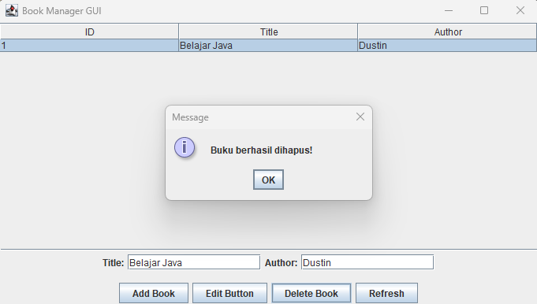

##### Tampilan Setelah Data Dihapus
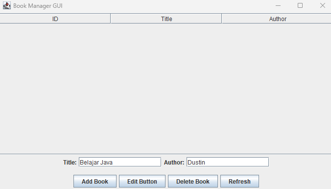
